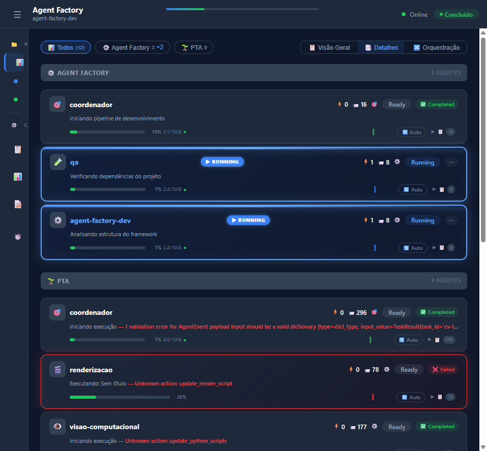
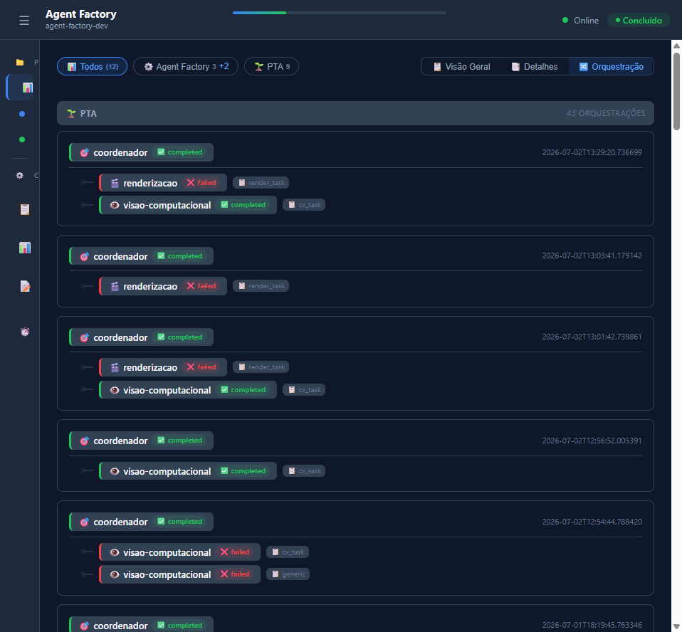
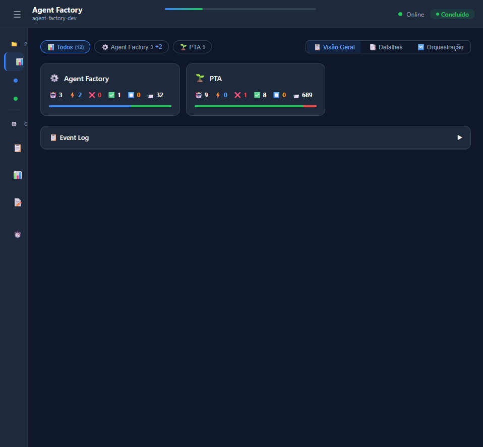

# Agent Factory

**Orchestration framework for autonomous AI agents with project segregation, real-time dashboard, and context-aware execution.**

<p align="center">
  <em>Beta — v2.0.0</em>
</p>

---

## Dashboard

### Dual Status Indicators

Each agent shows two independent statuses: operational *Status* (Ready/Running) and *Last Execution* (✅ Completed / ❌ Failed / ⏹️ Stopped). Agents stuck in "running" for more than 5 minutes are automatically detected as **stopped** (interrupted).

<p align="center">
  
</p>

- **Status**: Ready (idle) or Running (actively executing) — blue glow + **▶ Running** tag + shimmer
- **Last Execution**: ✅ Completed, ❌ Failed, or ⏹️ Stopped — shown as a color-coded pill
- **Ordering**: agents sort by last execution time descending — running agents jump to top

---

### Orchestration View

Hierarchical tree of coordinator → worker delegation chains, auto-detected from events. Each node shows real-time status and task type.

<p align="center">
  
</p>

- Detects `"Delegando tarefa X para subordinado"` messages from coordinators
- Maps task types to workers: `cv_task → visao-computacional`, `render_task → renderizacao`, `mobile_task → frontend-mobile`
- Correlates by timestamp window (3s) for accurate chain reconstruction
- Updates in real-time via polling cycle

---

### Overview Cards

Per-project summary cards with agent counts and segmented progress bars.

<p align="center">
  
</p>

- **🤖 Total**, **⚡ Running**, **✅ Completed**, **❌ Failed**, **⏹️ Stopped**, **📨 Events**
- Segmented bar visualizes distribution across status categories
- Click any card to filter agents by project

---

## Overview

Agent Factory is a Python framework for creating, orchestrating, and monitoring autonomous AI agents. It provides:

- **Agent orchestration** via LangGraph — coordinators delegate tasks to specialized workers
- **Real-time dashboard** — live monitoring with context bars, event logs, and per-agent pagination
- **Context-aware execution** — tracks token usage, KB growth, auto-compression at >80% capacity
- **Project segregation** — agents live in external projects, loaded on-demand by the factory
- **LLM integration** — pluggable providers (Groq, Ollama, Mock) for AI decision-making
- **Persistent context** — SQLite-backed memory across sessions

---

## Status

> **Beta** — This is the first public release. Core APIs are stable, but breaking changes may occur as the framework evolves. Feedback and contributions are welcome.

| What's working | What's in progress |
|---|---|---|
| Agent lifecycle (coordinator/worker/reviewer) | Package distribution (PyPI) |
| Real-time dashboard with dual status & orchestration view | CLI tooling |
| ContextManager with auto-compression | Windows System Tray Icon |
| AgentLoader for on-demand loading | Plugin system |
| LLM providers (Groq, Ollama, Mock) | Windows installer |
| MCP Server (6 tools + 4 resources) | Documentation site |
| Solar project (solarman-solar-monitor) | CI/CD pipeline |
| 60+ tests (incl. MCP + coordinator LLM) | Dashboard toast notifications |

---

## Architecture

```
agent-factory/
├── src/
│   ├── agents/
│   │   ├── base.py          # AgentBase, ContextManager, Coordinator
│   │   └── real.py          # SubprocessAgent, LLMAgent, ReviewerAgent
│   ├── protocols/
│   │   ├── schema.py        # Pydantic models
│   │   ├── events.py        # EventNotifier (JSONL + SSE)
│   │   └── tasks.py         # Task lifecycle
│   ├── persistence/         # ContextStore (SQLite)
│   ├── llm/                 # LLM providers
│   ├── dashboard/           # Real-time web dashboard
│   │   ├── server.py        # ThreadingHTTPServer
│   │   └── index.html       # Dark UI with context bars
│   ├── registry.py          # Project + agent registry
│   └── loader.py            # AgentLoader (on-demand loading)
├── tests/                   # 36+ pytest tests
├── docs/                    # LLM instructions, changelogs, screenshots
├── projects/                # External project configs
├── examples/                # Usage examples
├── pyproject.toml
└── README.md
```

### Key Concepts

| Concept | Description |
|---|---|
| **Agent** | Autonomous unit that executes tasks. Lives in an external project. |
| **Factory** | Platform that discovers, loads, and orchestrates agents on demand. |
| **Coordinator** | Agent that delegates tasks to specialized workers. |
| **ContextManager** | Tracks tokens/KB per agent, auto-compresses at >80% threshold. |
| **EventNotifier** | Emits events to JSONL files and real-time dashboard. |
| **Dashboard** | Web UI for live monitoring of agents, context, and event logs. |

---

## Quick Start

```bash
# Install
pip install -e /path/to/agent-factory
pip install -e /path/to/agent-factory[llm]   # with LLM support

# Run the dashboard (standalone mode — no agents)
python start_dashboard.py
# Open http://localhost:8080?project=pta

# Run agents with dashboard
python test_dashboard.py
```

### Define an Agent

```python
from src.agents.real import SubprocessAgent, LLMAgent
from src.llm import get_provider

# Code-executing agent
executor = SubprocessAgent(
    agent_id="executor",
    project_id="my-project",
    notifier=notifier,
)

result = executor.run({
    "task_id": "task-1",
    "code": "print('Hello, world!')",
})

# LLM-powered agent
analyst = LLMAgent(
    agent_id="analyst",
    project_id="my-project",
    notifier=notifier,
    provider=get_provider("groq"),
    system_prompt="You are a data analyst.",
)

result = analyst.run({
    "task_id": "task-2",
    "prompt": "Analyze this dataset...",
})
```

### Monitor with Dashboard

```python
from src.dashboard.server import DashboardServer
from src.protocols.events import EventNotifier

notifier = EventNotifier("my-project")
server = DashboardServer(notifier, port=8080)
server.start()
# → http://localhost:8080?project=my-project
```

---

## Dashboard Features

- **Dual status indicators** — Operational Status (Ready/Running) + Last Execution (✅ Completed / ❌ Failed / ⏹️ Stopped)
- **Running highlight** — blue top bar with glow, **▶ Running** pulse tag, shimmer sweep, blue border and background
- **Orchestration view** — hierarchical tree of coordinator → worker chains, auto-detected from delegation events
- **Overview cards** — per-project summary with running/completed/failed/stopped counts and segmented bars
- **Agent cards** — horizontal layout with name, role, dual badges, activation mini-chart, context bar
- **Context bar** — real-time token/KB usage with color-coded status (ok/warning/exhausted)
- **Per-agent event log** — paginated (10 per page), expandable within each card
- **Main event log** — collapsible global log with date/time/agent/task/status columns
- **Pulse animations** — running agents glow blue with shimmer, failed agents glow red
- **Sidebar** — collapsible with project filters (Todos/AFD/PTA) and settings toggles
- **Responsive** — adapts to 900px and 600px breakpoints, columns hide on smaller screens
- **SSE-ready** — designed for Server-Sent Events (currently uses 1s polling)

---

## MCP Server (AI Agent Integration)

Expose os agentes do Agent Factory como **tools e resources MCP** para qualquer LLM (OpenCode, Claude Code, Cursor, etc.) consumir.

### Iniciar

```bash
python start_agent_factory.py --mcp
# Servidor MCP em http://127.0.0.1:8081/sse
```

### Tools disponiveis

| Tool | Descrição |
|------|-----------|
| `list_projects` | Lista projetos registrados e seus agentes |
| `list_agents` | Lista agentes de um projeto com capacidades |
| `run_agent` | Executa tarefa em um agente específico |
| `run_objective` | Envia objetivo de alto nível ao coordenador |
| `read_events` | Lê eventos recentes de um projeto |
| `get_project_status` | Status consolidado de um projeto |

### Resources disponiveis

| URI | Conteúdo |
|-----|----------|
| `afp://{project}/events` | Eventos recentes |
| `afp://{project}/agents` | Referências dos agentes |
| `afp://{project}/{agent}/context` | Arquivo de contexto do agente |
| `afp://{project}/{agent}/capabilities` | Capacidades do agente |

Como usar — veja [AGENTS.md](AGENTS.md) para o fluxo completo de delegação recursiva.

---

| Provider | Type | Setup |
|---|---|---|---|
| [Groq](https://groq.com) | Cloud | `GROQ_API_KEY` env var |
| [DeepSeek](https://platform.deepseek.com) | Cloud (gratuito) | `DEEPSEEK_API_KEY` env var |
| [OpenRouter](https://openrouter.ai) | Cloud (gratuito) | `OPENROUTER_API_KEY` env var |
| [Ollama](https://ollama.ai) | Local | Run `ollama serve` on port 11434 |
| Mock | Test | No setup required |

```python
from src.llm import get_provider

# Auto-detect (groq → deepseek → openrouter → ollama → mock)
provider = get_provider("auto")

# Or specify
provider = get_provider("groq", api_key="your-key")
provider = get_provider("deepseek", model="deepseek-chat")
provider = get_provider("openrouter", model="cognitivecomputations/dolphin-mixtral-8x7b:free")
provider = get_provider("ollama", model="llama3.2")
provider = get_provider("mock")
```

---

## Context Management

Agents track context usage automatically via `ContextManager`:

```python
# Context usage is embedded in every event
event.metrics.context = {
    "used_kb": 2.3,
    "limit_kb": 10.0,
    "tokens": 580,
    "token_limit": 2000,
    "percentage": 23.0,
    "status": "ok",
    "needs_compression": False,
}
```

- Auto-compression triggers at >80% usage
- Growth trends: `growing` / `stable` / `shrinking` with exhaustion projection
- State persisted per-agent in `.agent-context/`

---

## Testing

```bash
# Run all tests
python -m pytest tests/ -v

# With coverage
python -m pytest tests/ -v --cov=src --cov-report=html
```

---

## License

MIT © Rafael Drummond

---

*Built with LangGraph, Pydantic, and a lot of coffee.*
